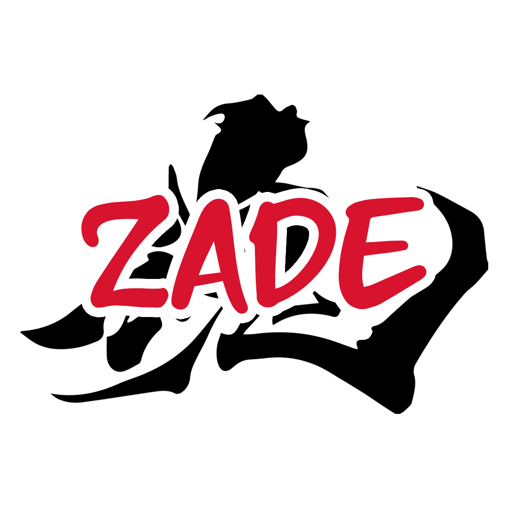
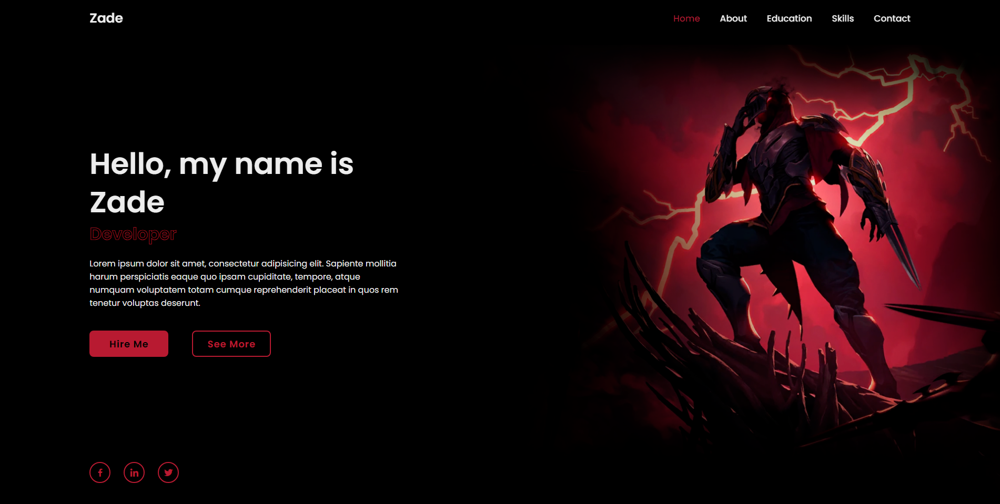

<h1 align="center">

Projeto portfólio próprio!
 
</h1>

## ▶ Sobre

Um projeto feito com fins de pesquisa e estudo aprofundado sobre estruturas de sites. Foi feito em um período de uma semana, utilizando o conhecimento que adiquiri em cursos e na graduação.

## ⚙ Página principal

## 🏳 Meu processo

Como ainda estou iniciando os meus estudos, com esse projeto pude me aprofundar um pouco mais na parte da programação, especificamente voltado a Web, pude testar ferramentas e dar o primeiro passo nessa caminhada longa, apliquei todo o conhecimento que pude adquirir nesse período.

### 🔨 Construído com

- [HTML](https://developer.mozilla.org/en-US/docs/Web/HTML)
- [CSS](https://en.wikipedia.org/wiki/CSS)
- [JavaScript](https://www.javascript.com/)

## 🖥 Aprendizado

Me habituei e consegui me situar muito bem com a construção web.

## 🧥 Como contribuir?

1. Primeiro, [bifurque este repositório](). Isso adicionará a versão atual do repositório à sua conta.

2. Agora você pode baixá-lo para sua máquina e alterar o que quiser (recomendo usar o [Live Server](https://marketplace.visualstudio.com/items?itemName=ritwickdey.LiveServer) para testes).